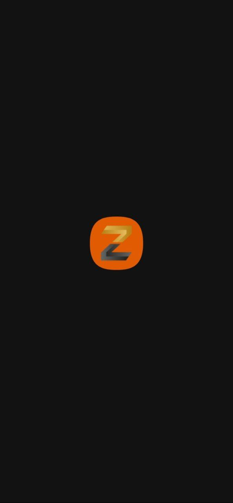
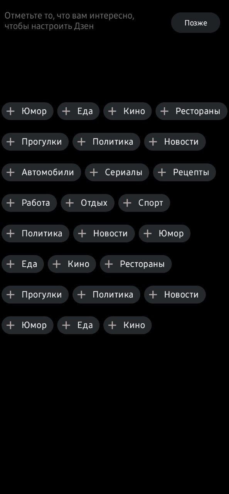
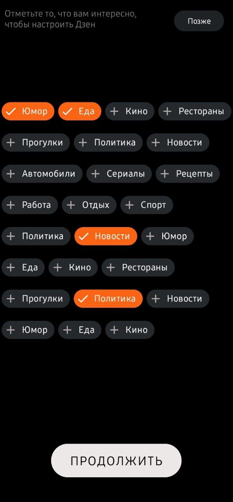
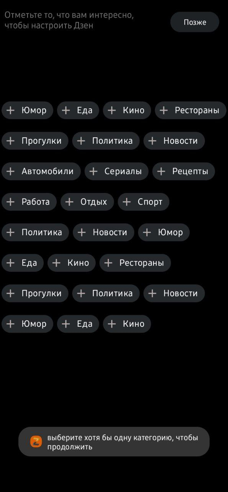

# VkCup2022
VK Cup for 2022 Mobile Development

## First Round
### Zen.apk
#### Task:
The Zen mobile app shows users a feed of the most interesting posts. For first-time users entering the application, we show a selection of many categories that they might like. Design a selection screen for interesting categories.

Below is a layout of the basic version of such a screen. Develop a single screen mobile application where the user can choose interesting topics. Layouts in Figma will help you navigate: https://vk.cc/cjh0Ho .

### ScreenShots

   

  
   

  
   

  
   

  

